# CHERRY-CREEK-STORES

## Introduction

This dataset contains sales data from an imaginary online store known as "Cherry creek superstores" 
who specialize in the sale of Office supplies, Furniture and Tech stuff. it includes order id; date of order/
shipping, info about the customer, info about the products, total sales, profit.... The project is to clean, analyze, 
visualize my insight to answer crucial questions and help the store make informed decisions in the coming year.
**-Disclaimer_** ; _all datasets and reports do not represent any company, institution, or country but a random dataset
 found online for personal projects to demonstrate the functions and power of Excel._ 

## Problem Statement
For this business problem presented by the manager of cherry creek super stores, they are entering a new 
business year and based on the stores performance in the previous years, they want to know if they are segments, 
months, years, products they should pay more attention to.
They'll like my insights regarding the data and i came up with this questions;
1. Total profit by segment and category?
2. Sum of sales sold in each year?
3. The region with the highest profit?
4. The month with the highest sales? 
5. The no of quantities sold for each sub-category?
6. The discount for each segment with the highest and lowest discount?

## Skills/ Steps Demonstrated 
- Import data; first we need to import and understand the dataset.
- Data cleaning: As a good example, the date values are currently text (string), sometimes in universal or 
US format. We need to standardize the format, then change the type to date type.
Replace every "Central" to "North" in region column,simply delete the incomplete rows, no blanks.create a threadline
for order date for the last 5 years using the text function repeat same process for months.
- Data processing 
- Data analysis
- Visualization
- Report

## Visualization
The report comprises of a single page of
- Profits by segment & category
- Total sales sold in 4 years
- Profits by region
- Total discount for each segment

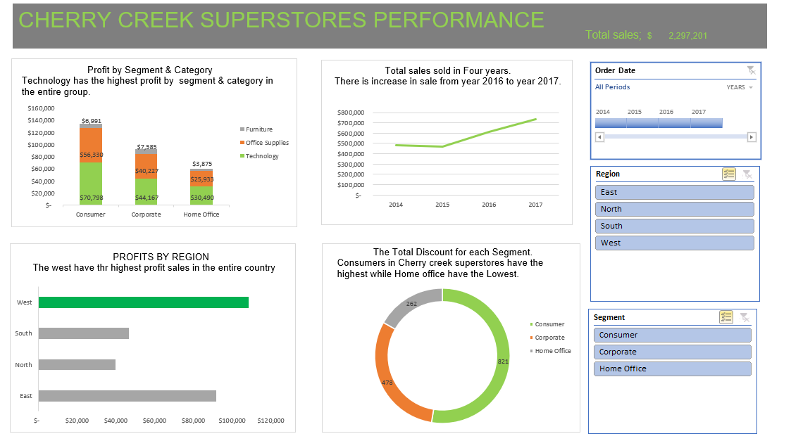
FULL REPORT

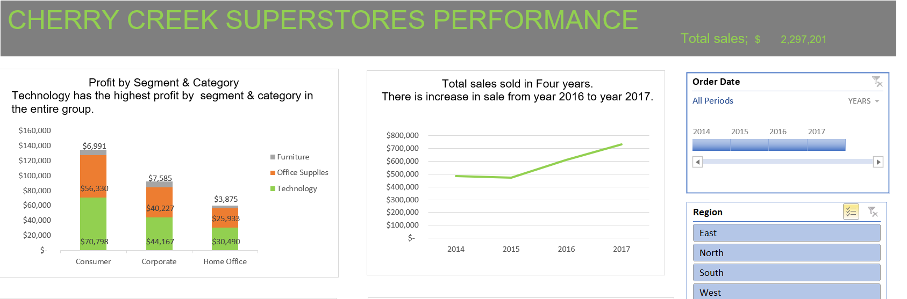

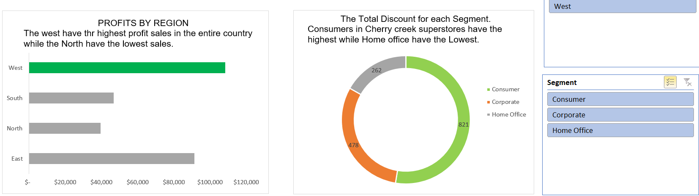

### Features

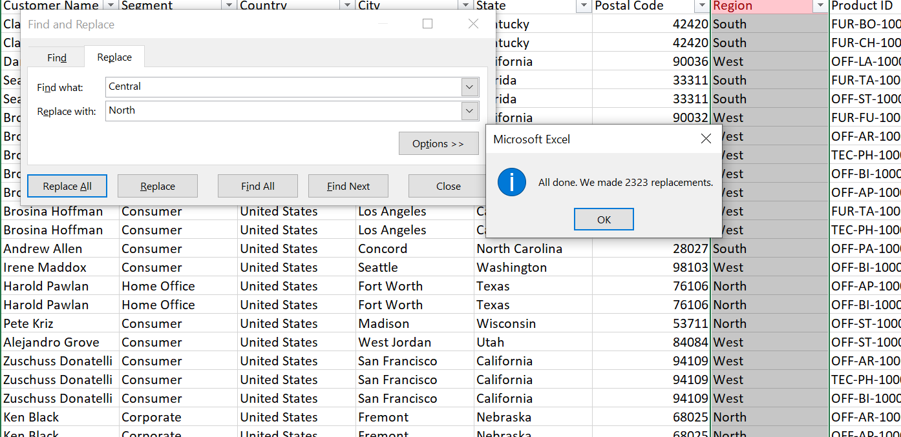
 
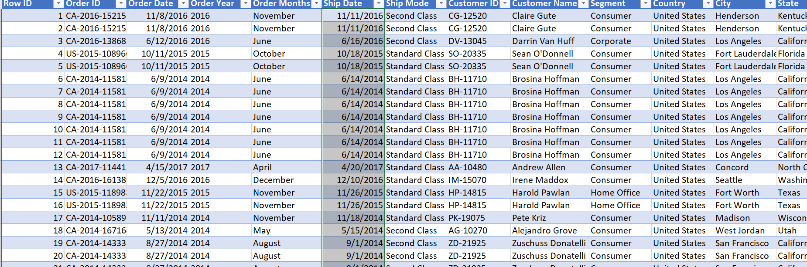

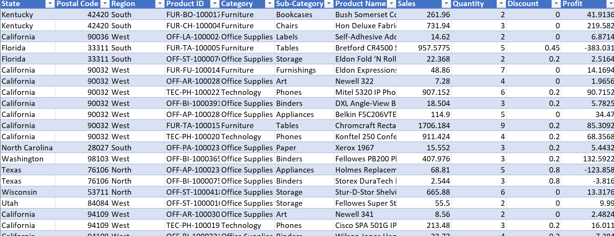

## Pivot charts

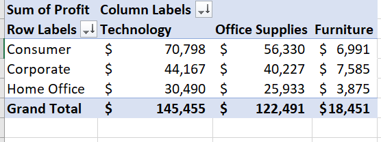
Total profit by segment and category?

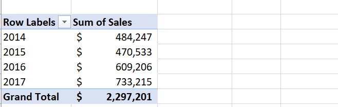
Sum of sales sold in each year?

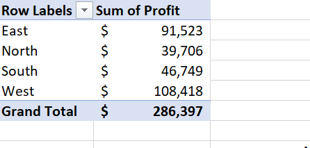
The region with the highest profit?

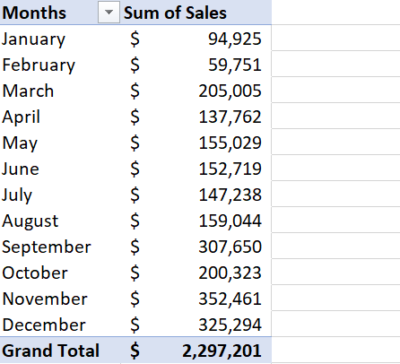
The month with the highest sales?

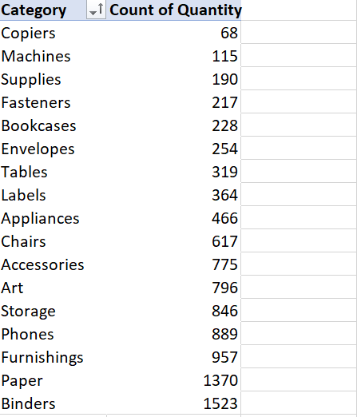
The no of quantities sold for each sub-category?

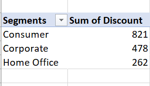
The discount for each segment with the highest and lowest discount?

## Analysis;

The store currently have a total of 1390 customers
The highest profit made by the store is from Technology sales mostly by consumers
The year 2017 have the highest sales, the store had increase in sales  from year 2016
The west have the highest profit sales in the entire region.
The consumers have the highest discount.

## Conclusion/ Recommendation;

In this quick analysis, we performed standard and easy data manipulation to understand and analyze cherry creek stores. 
I performed a superficial analysis here... And you're right!
In real life, we would need to answer every additional question we found during the exploratory analysis, 
and probably more topics to analyze once all the said questions are answered. Finally, excel is a great tool to dive into dataset,
and it provides robust andeasy-to-use dashboard for end users.

